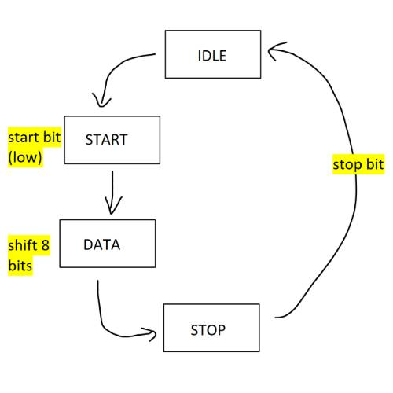

# UART Simulator with RS232 in SystemVerilog

## Overview

This project implements a Universal Asynchronous Receiver/Transmitter (UART) in SystemVerilog, designed for simulation in Quartus Prime with ModelSim.
The design models the UART’s digital logic, frame structure, and timing, and includes a conceptual RS-232 layer to demonstrate voltage inversion and signaling conventions without requiring FPGA hardware.

The goal is to demonstrate digital logic and microcontroller communication concepts rather than to produce a hardware-ready implementation.

(This project is currently WIP)

---

## Features

* UART Frame Format: 8N1 (1 start bit, 8 data bits, no parity, 1 stop bit)
* Parameterizable clock frequency and baud rate
* Default simulation: CLK_FREQ = 10 MHz, BAUD_RATE = 1 Mbps
* 1-byte holding registers for TX and RX (no FIFOs in V1)
* Baud rate generator for both TX and RX timing
* Conceptual RS-232 module (logic inversion, voltage level representation)
* Loopback testbench for self-contained verification
* Fully modular design for future extensions (parity, FIFOs, oversampling)

---

## Module Breakdown

### 1. `uart_top.sv`
Top-level module that instantiates and connects:
* Baud generator
* UART transmitter
* UART receiver
* RS-232 conceptual interface

### 2. `baud_gen.sv`
Generates baud_tick based on CLK_FREQ and BAUD_RATE
* Shared by both TX and RX FSMs

### 3. `uart_tx.sv`
Transmits serial data from an 8-bit parallel input
* FSM: IDLE → START → DATA bits → STOP → IDLE
* Sends bits LSB first

### 4. `uart_rx.sv`
Receives serial data into an 8-bit parallel output
* FSM: IDLE → START detect → DATA bits → STOP check → IDLE
* Samples each bit in the middle of its period
* Double flop synchronizer for metastability
* Recieves bits LSB first

### 5. `rs232_phy.sv` (simulation only)
Demonstrates RS-232 voltage inversion conceptually:
* Logic 0 → positive voltage (e.g., +12 V equivalent)
* Logic 1 → negative voltage (e.g., −12 V equivalent)
* No electrical hardware modeling — purely for waveform visualization

### 6. `uart_tb.sv`
Generates simulation clock
* Instantiates uart_top
* Loopback mode: TX output connected to RX input
* Sends a test sequence of bytes and verifies reception
* Displays TX and RX waveforms with start/data/stop bits clearly visible

---

## Simulation Parameters
| Parameter	| Default Value	| Description                   |
| --------- | ------------- | ----------------------------- |
| CLK_FREQ	| 10 MHz	      | Simulation system clock       |
| BAUD_RATE	| 1 Mbps	      | UART baud rate                |
| DATA_BITS	| 8	            | Number of data bits per frame |
| STOP_BITS	| 1	            | Number of stop bits           |
| PARITY	  | None	        | No parity bit in V1           |

---

## Example Waveform

In simulation, you’ll see:
* Start bit (low)
* 8 data bits (LSB first)
* Stop bit (high)
* RS-232 conceptual signal (simulated voltage inverted and shifted for demonstration)

---

## Future Improvements

* Parity support (even/odd)
* Configurable stop bits
* Deeper TX/RX FIFOs
* RX oversampling for noise tolerance
* Hardware-level RS-232 via MAX232 if moved to FPGA

## Notes

* This project is meant purely as a simulation
* Baud generation being shared by TX and RX is for ease of simulation

---

## Contact
Email: tylerli3@illinois.edu
